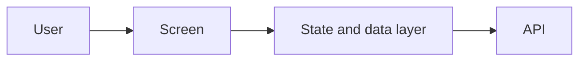

## Summary

> Describe the problem and the proposed technical approach in 3–5 sentences. A reviewer should understand the purpose and direction of the change from this section alone.

## Background and Scope

### Background

> Explain the current structure, the problem, and why a change is needed. Focus on context relevant to the technical design rather than repeating product requirements.

### Goals

* [Outcome this design aims to achieve]

### Non-goals

* [Scope intentionally excluded from this work]

### References

* Related issue: @TEAM-000
* Product and design: [link]
* API and related documentation: [link]

## Technical Design

### Proposed Approach

> Describe the implementation approach and overall structure. Include only the screens, routing, components, state, and data flow needed to understand the design.

### Areas of Change

* [Pages, modules, or components to change and their responsibilities]
* [State and data flows to add or change]
* [APIs to integrate and their key contracts]
* [Existing implementations to reuse or replace]

### Key Design Decisions

#### [Decision title]

* Decision: [Chosen approach]
* Rationale: [Reason for this choice]
* Trade-offs: [Benefits and costs]

## User Experience and Edge Cases

> Include only states outside the normal flow that affect the design. Examples: loading, empty states, errors, insufficient permissions, duplicate requests, and partial failures.

* [Situation]: [User-visible outcome and recovery path]

## Impact and Risks

> Describe the impact on existing functionality and the main risks. Include performance, accessibility, localization, analytics events, browser compatibility, and security only when relevant to this change.

* Impact: [Affected features, users, or systems]
* Risk: [Potential problem]
* Mitigation: [Prevention, mitigation, or monitoring]

## Alternatives Considered

### [Alternative title]

* Approach: [Alternative approach]
* Reason not selected: [Rationale]

## Validation and Rollout

### Validation

* [Tests that validate core behavior and design decisions]
* [Items to check manually]

### Rollout

* Rollout method: [Standard release, gradual rollout, feature flag, etc.]
* Post-release checks: [Errors, metrics, or user flows to monitor]
* Rollback: [Include only if separate action is needed]

## Open Questions

- [ ] [Question to resolve during review] — @[Owner]
